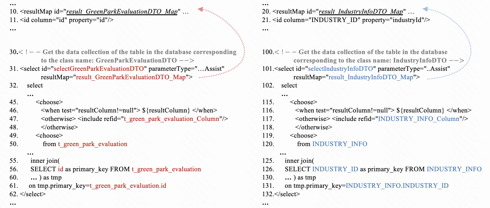
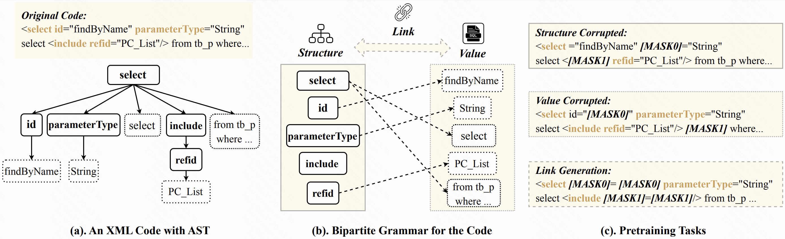
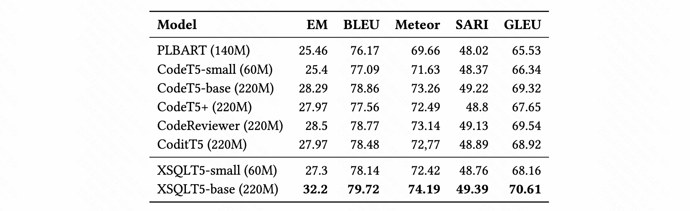

# Introduction

The repository for Paper "Specific-Component Aware Pretraining for XML Code Updating"

The above figure shows an XML-formatted file containing multiple XML code blocks. The code block in lines 30-62 is used to query information of `GreenParkEvaluationDTO` , while the code block in lines 100-132 is used to query information of `IndustryInfoDTO`. For better presentation, we utilize different color to highlight the changed content and place the code fragments referenced by these two queries above their respective locations~(i.e., with the code starting from line 10 and line 20). These two XML's query code have similar functionalities and structures, and such similar scenarios may appear many times within the same file.
**In this scenario, referencing existing XML code and automatically updating the target XML code has become a intuitive way for improving the efficiency of XML code development**. 

To enable the model to capture XML-SQL information, we design the bipartite-grammar aware~(BGA) framework.  This framework integrates XML grammar information into the pre-training process by separately learning and then linking the grammar components, thereby enhancing the ability of existing general models to adapt to the XML domain.

The above table illustrates a comparative analysis of experimental results between XSQLT5 and generic code models. Notably, when holding the similar parameter scale, models fine-tuned on XML-specific pre-trained models consistently outperform those fine-tuned on generic code models. 

# Dataset
You can find the TwinXSQL dataset from `/data/TwinXSQL`.

# Models
You can find the model with fine-tuned weights from `/models`.

# Fine-tuning
You can find the fine-tuning details from `/src`.